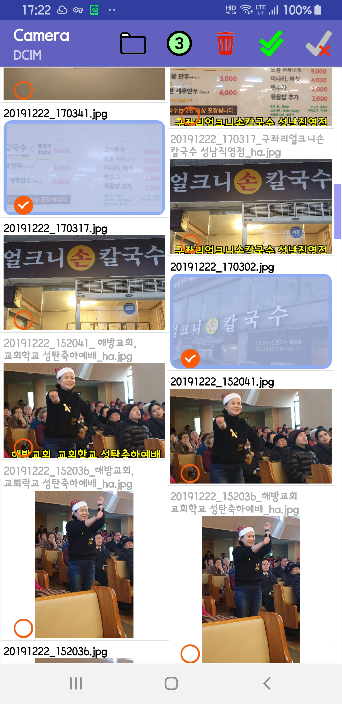
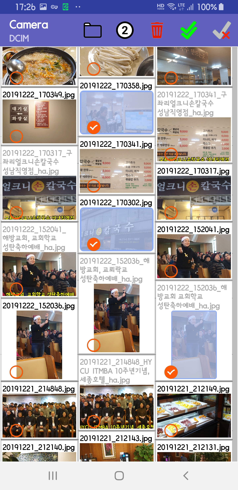
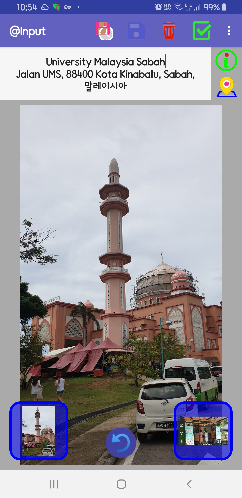
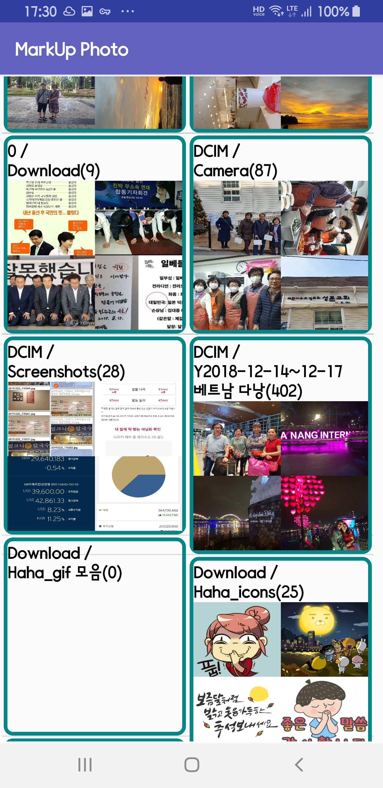

# Photo Tag

With this application, you can create place, date time taged photo from native photo

It retrieves exif info from your photo and ask you right POI places based on that GPS info.

This application is useful if you want to memorize where you visited in photo

## Permission Required

```
    <uses-permission android:name="android.permission.WRITE_EXTERNAL_STORAGE" />
    <uses-permission android:name="android.permission.INTERNET" />
    <uses-permission android:name="com.google.android.providers.gsf.permission.READ_GSERVICES" />
    <uses-permission android:name="android.permission.ACCESS_FINE_LOCATION" />
```

## Source in github

Application source can be downloaded from [my github][1].

[1]: https://github.com/riopapa/blackphoto

## Main Screen

Run this program, and it shows all the photos in your Camera directory.

<br>&nbsp;&nbsp;&nbsp;&nbsp;&nbsp;&nbsp;&nbsp;&nbsp;&nbsp;&nbsp;&nbsp;&nbsp; 

<br>&nbsp;&nbsp;&nbsp;&nbsp;&nbsp;&nbsp;&nbsp;&nbsp;&nbsp;&nbsp;&nbsp;&nbsp; 


1. <**cancel select**> icon &nbsp;&nbsp; will reset all selected items.

2. Select one or multiple photos using check mark, then press <**multi select**> icon . New Photo(s) will be create with timestamp (from photo Exif information) and signature logo at the bottom

3. If <**delete**> icon  is pressed, confirm message to delete will be prompted (multiple selection available).
4. <**2 or 3**> icon  &nbsp;&nbsp; ,  &nbsp;&nbsp;  is for switching two photos or three photos in one row.

5. <**folder**> icon  &nbsp;&nbsp;  is for changing directory to access photos.

- By pressing one photo (not check mark area), it will ask you google place information, and the shows big photo with place, address information selection by google map. (refer to <**One photo screen**>)

- _**Now Building nowCount/totalCount**_ will be displayed while building small images, you can press <**hide**> button not to display any time.

## MarkUp Place Screen

<br>&nbsp;&nbsp;&nbsp;&nbsp;&nbsp;&nbsp;&nbsp;&nbsp;&nbsp; 

- If you press  <**Apply**> icon &nbsp;&nbsp; it will create marked photo with date,time, place, address, those goes to suffix of file name, e.g. __20191007_130414 Korean Village Restaurant_ha.jpg__. <br>And this file will be displayed in photos with grayed file name title.

- If <**Delete**> icon  is pressed, confirm message to delete will be prompted

- <**Save**> icon  will be activated only when you press at the bottom is pressed, which will roate the photo.


- <**Rename to clock**> icon  is for renaming file name with the date photo has in Exif. This is usefull when your photo has only random number file name.

- Images at the bottom right/left is for navigating to next photo.
 
- If you press  <**go_back**> button screen, photo list will be shown.

## Directory Screen

<br>This screen comes out when you press  <**folder**> icon  &nbsp;&nbsp; , each active directory folder containing photos will be promted with max 4 photos.
<br>remarks: Default folder is _*DCIM/Camera*_

<br>&nbsp;&nbsp;&nbsp;&nbsp;&nbsp;&nbsp;&nbsp;&nbsp;&nbsp;
<br><br>Each directory folder will show max 4 photos in that directory.

- By clicking one directory photo, main activity will be displayed.

- Making sumNails will be processed at the background with showing progress at the bottom


## What I have learned while developing this app

- RecyclerView
- Masking imageView
- SnackBar
- Exif handling

## Comments

- Android SDK API 30 or above 
- secrete.xml should be provided by yourself for google maps api key
```
<?xml version="1.0" encoding="utf-8"?>
<resources>
    <string name="maps_api_key translate="false">AIzaSyCEun8V0vX_idWcvanxxxxxxxxxx</string>
</resources>
```

